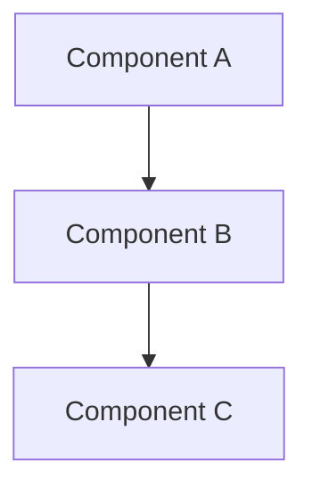

# Note Template

Every wiki note MUST follow this format. The YAML frontmatter is required for Obsidian's Properties panel and graph view.

## Full Template

```markdown
---
title: <Note Title>
type: <architecture | module | concept | guide | reference>
tags: [list, of, tags]
related: ["[[other-note]]", "[[another-note]]"]
last_updated: YYYY-MM-DD
---

# <Title>

## Summary
One paragraph summary. This is what an LLM reads first to decide if the note is relevant.

## Details
... (the meat of the note)

### Subsection
- Use subsections for complex topics
- Include code blocks with language specification

```rust
// Example code with syntax highlighting
pub fn example() -> Result<()> { ... }
```

### Mermaid Diagrams
Use Mermaid for architecture, data flow, and sequence diagrams:



## Key Types / APIs
- `TypeName` - brief description of what it represents
- `function_name()` - what it does
- `TraitName` - what it requires

## Relationships
- Depends on [[other-module]]
- Consumed by [[another-module]]
- Related concept: [[concept-note]]
```

## Type Values

| Type | Used for |
|------|----------|
| `architecture` | System-level design notes, data flow, component maps |
| `module` | One note per crate/package/module/directory |
| `concept` | Domain concepts, patterns, techniques (not tied to one file) |
| `guide` | How-to instructions, setup, testing, usage |
| `reference` | API references, link collections, glossaries, indexes |

## Writing Guidelines

- **Summary first**: The first paragraph is the most important. An LLM reads it to decide relevance.
- **Be specific**: Name actual types, functions, files. Not "a helper function" but "`parse_dispatch()` in `dispatch.rs`".
- **Link liberally**: Every mention of another module or concept should be a `[[wikilink]]`. The graph is the point.
- **Code blocks with language**: Always specify the language for syntax highlighting.
- **Keep atomic**: One note = one concept. If a note covers two things, split it.
- **No narrative comments**: Notes document what IS, not what was done during the build.

## YAML Frontmatter Rules

- `title`: Human-readable, matches the `# Heading`
- `type`: One of the 5 values above
- `tags`: Lowercase, hyphenated, 2-5 tags
- `related`: Array of `[[wikilinks]]` to the most relevant notes (2-6 links)
- `last_updated`: `YYYY-MM-DD` format
